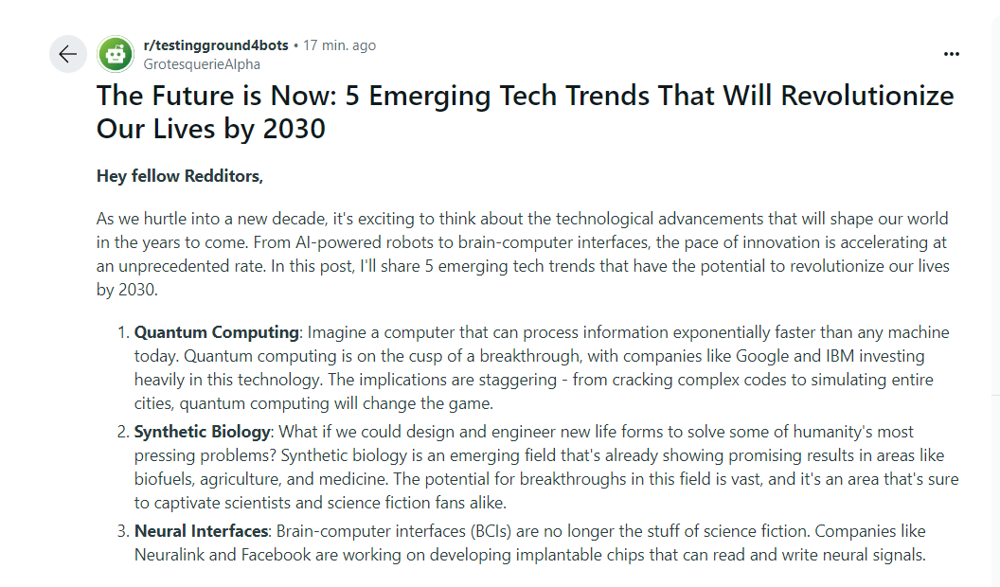
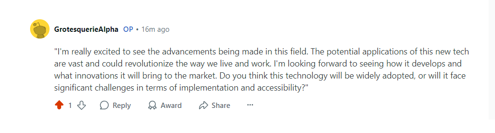
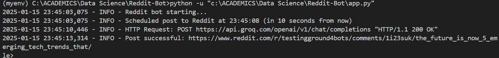

# Reddit Bot Using Groq AI

This project is a Reddit bot that automatically generates and posts content to Reddit daily using the Groq AI API. It can also comment on posts and is customizable for scheduling and prompt inputs.

## Features

- **Daily Automated Posting**: Posts AI-generated content to Reddit at a user-defined time.
- **Content Generation**: Leverages Groq AI to generate engaging content based on a prompt.
- **Error Handling**: Logs errors and provides feedback for smoother operations.
- **Commenting Capability**: Generates and posts comments on Reddit posts (optional).

## Setup

### Prerequisites

1. **Python 3.7+**
2. **Reddit Account** with API credentials
3. **Groq API Key**

### Installation

1. Clone this repository:
   ```bash
   git clone https://github.com/your-username/reddit-bot.git
   cd reddit-bot
   ```
2. Create and activate a virtual environment:
   ```bash
   python -m venv venv
   source venv/bin/activate   # On Windows: venv\Scripts\activate
   ```
3. Install the required dependencies:
   ```bash
   pip install -r requirements.txt
   ```
4. Set up a `.env` file in the root directory with the following variables:
   ```env
   GROQ_API_KEY="your_groq_api_key"
   REDDIT_CLIENT_ID="your_reddit_client_id"
   REDDIT_CLIENT_SECRET="your_reddit_client_secret"
   REDDIT_USERNAME="your_reddit_username"
   REDDIT_PASSWORD="your_reddit_password"
   REDDIT_USER_AGENT="your_reddit_user_agent"
   ```

### Usage

1. Edit the `PROMPT`, `SUBREDDIT`, and `TIME_OF_DAY` variables in the `app.py` script to customize the bot:
   ```python
   PROMPT = "Generate an engaging and interesting Reddit post on the topic of technology and innovation."
   SUBREDDIT = "testingground4bots"
   TIME_OF_DAY = "09:00"
   ```

2. Run the bot:
   ```bash
   python app.py
   ```

3. To schedule the bot using Task Scheduler or a cron job, refer to the **Scheduling** section below.

## Output

### Example Generated Post

**Title:** "The Future of AI: 5 Ways It's Changing Our Lives"

**Body:**
```
Artificial Intelligence (AI) is no longer a concept of the future—it’s here, and it’s transforming the way we live and work. Here are five key ways AI is making an impact:

1. Personalized Medicine: AI algorithms analyze patient data to provide tailored treatments.
2. Smarter Cities: Traffic management systems powered by AI reduce congestion and improve safety.
3. Enhanced Education: AI tutors provide personalized learning experiences for students.
4. Environmental Monitoring: AI tools track deforestation and predict natural disasters.
5. Creative Industries: AI-generated art, music, and stories are becoming mainstream.

What do you think? How else will AI shape our world?
```

### Screenshots

#### Successful Post to Reddit


#### Successful Comment to Reddit


#### Log Output


## Scheduling

To run the bot daily without keeping the script active, use one of the following methods:

### Using Task Scheduler (Windows)

1. Open Task Scheduler and create a new task.
2. Set the trigger to "Daily" and specify the desired time.
3. Set the action to "Start a Program" and browse to your Python executable.
4. Add the `app.py` script as an argument.
5. Save and enable the task.


## Acknowledgements

- [PRAW Documentation](https://praw.readthedocs.io/)
- [Groq AI API](https://groq.com/docs)
